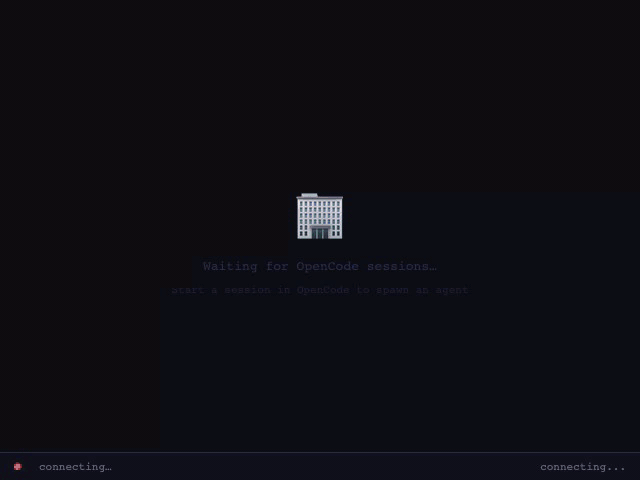
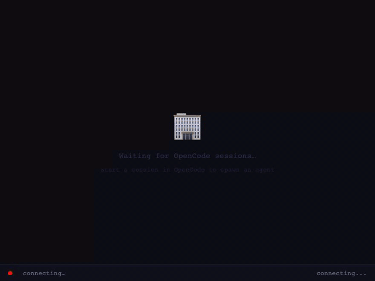
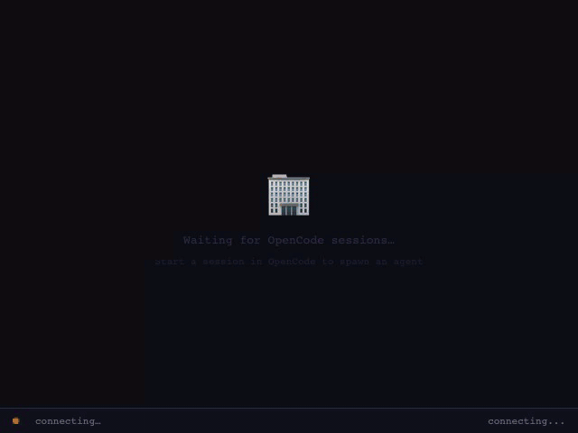

# Blob Office

> **Attribution**: This project is a fork of [Session Character Visualizer](https://github.com/Caffa/Session-Character-Visualizer) by [@Caffa](https://github.com/Caffa), who created the original concept, plugin architecture, and p5.js blob renderer. The `opencode-blob-office` npm package builds on that foundation.


An [OpenCode](https://github.com/anomalyco/opencode) plugin that visualizes AI coding sessions as animated blob characters in a virtual office.


Each session appears as a colored blob with speech bubbles, status animations, and idle eye expressions. Subagents orbit their parents. The viewer runs in a browser via p5.js, connected over WebSocket.

| Agent Lifecycle | Subagents | Error Recovery | Multi-Session |
| :---: | :---: | :---: | :---: |
|  |  |  |  |

---

## Installation

```bash
bunx opencode-blob-office install
```

Or with npx:

```bash
npx opencode-blob-office install
```

Restart OpenCode. The viewer opens automatically in your browser at `localhost:2727`.

### Manual

```bash
git clone https://github.com/cbrunnkvist/opencode-blob-office.git
cd opencode-blob-office
bash install.sh
```

---

## Features

- **Unified server** — single port serves both HTTP viewer and WebSocket
- **Graceful disconnect** — blobs fade out on disconnect, viewer reconnects with backoff
- **Idle eye expressions** — sleeping blobs occasionally peek, glance, or go half-lidded
- **Real filenames in code panels** — editing blobs show actual files being touched
- **File activity tracking** — all file-touching tools (read, glob, grep) tracked, not just writes
- **npm packaging** — `bunx opencode-blob-office install` / `npx opencode-blob-office install` with CLI
- **Test infrastructure** — bun:test unit/integration suite + Playwright E2E tests
- **Graceful shutdown** — `serverclosing` message on SIGINT/SIGTERM so viewer can fade + close

---

## Agent States

| State    | Visual                             | Description                                                        |
| -------- | ---------------------------------- | ------------------------------------------------------------------ |
| Idle     | Closed eyes, slow pulse            | Finished work, waiting. Subagents removed after 10s.               |
| Thinking | Expanding ring, sparkles           | Processing/generating. Eyes track rhythmically.                    |
| Editing  | Code panel with typewriter          | Writing/editing files. Panel shows actual filenames.               |
| Reading  | Glasses, book opens/closes          | Reading files, searching. Glasses wobble.                          |
| Running  | Fast pulse, motion streaks          | Executing bash commands.                                           |
| Waiting  | Nervous shake, bouncing question    | Blocked on permission, or supervising subagents.                   |
| Error    | X_X eyes, red pulse                 | Something went wrong.                                              |

Each agent gets a unique hue derived from its session ID. Subagents use parent hue +30°.

---

## Architecture

```
blob-office.ts          Plugin — hooks into OpenCode events, serves HTML + WebSocket
blob-office.html        Viewer — p5.js canvas, WebSocket client, all rendering
blob-office-mock-server.ts  Mock server for testing
```

- Single server on port 2727 (scans up to 2736 if taken)
- Event-driven via OpenCode hooks (`tool.execute.before/after`, `event`)
- Multiple OpenCode instances sync agents through the same server
- No bundler, no framework

---

## Development

```bash
# Run all tests
bun run test

# Unit tests only
bun run test:unit

# Playwright visual tests
bun run test:visual

# Mock server for local dev
bun run mock-server

# Regenerate preview GIFs (requires ffmpeg)
bun run preview:generate
```

---

## Troubleshooting

**Viewer doesn't open**: Navigate to `http://localhost:2727` manually.

**Port conflicts**: Plugin auto-discovers ports 2727–2736. Check OpenCode logs for `[blob-office]`.

**No agents appearing**: Check OpenCode logs, run `bun install` in plugin folder, check browser console.

---

## Releasing

```bash
npm version patch   # or minor, major
git push && git push --tags
```

`npm version` bumps `package.json`, commits, and tags atomically. The tag push triggers CI which runs tests and publishes to npm with provenance. Never use `git tag` manually.

---

## License

MIT — see upstream repository for original license terms.
